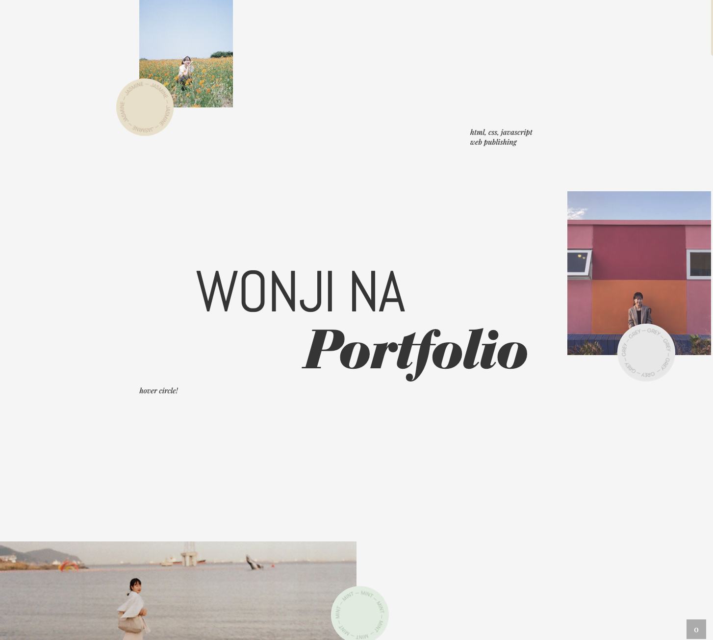
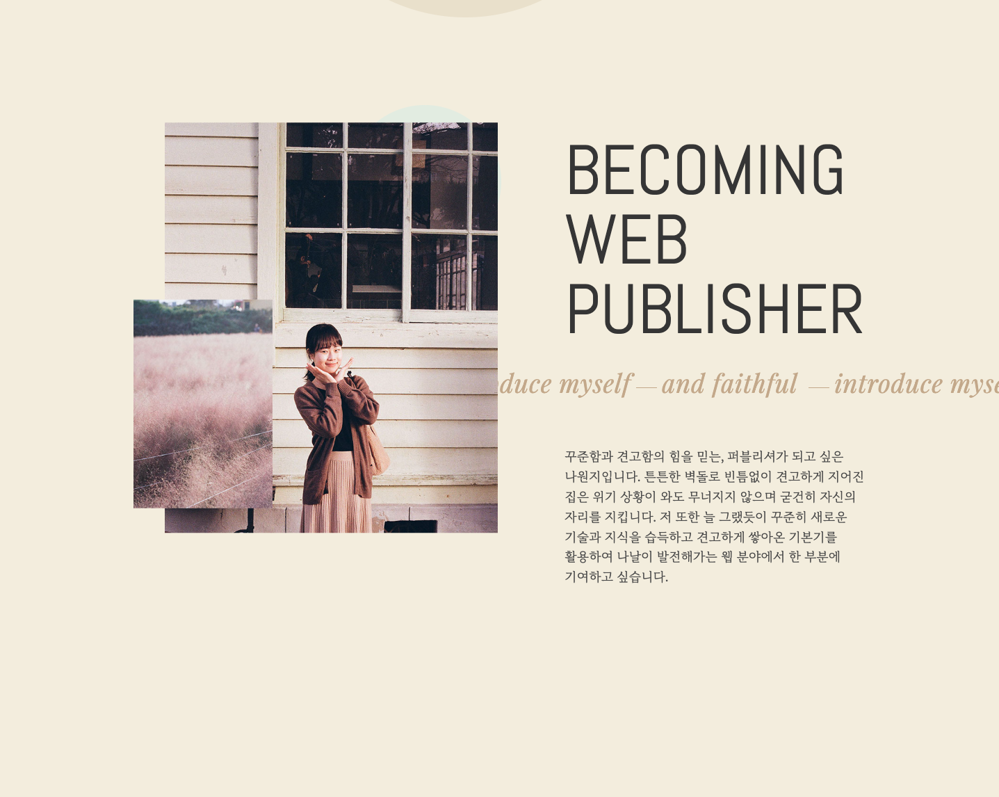
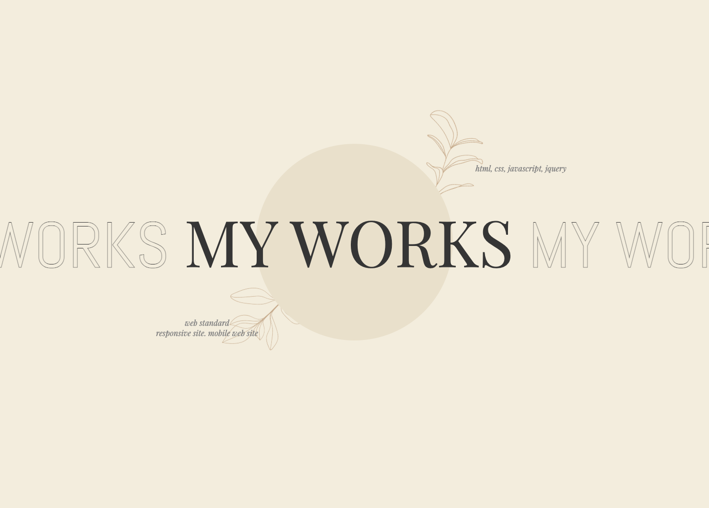
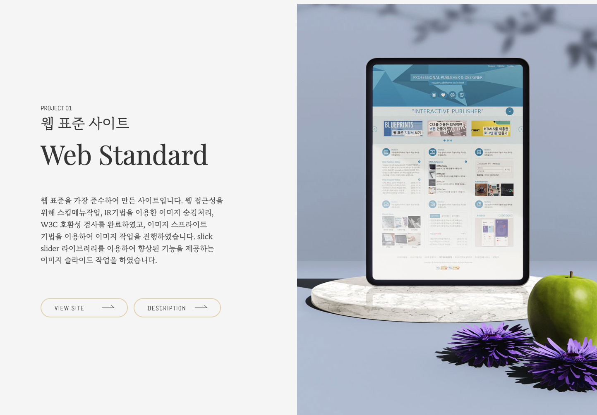
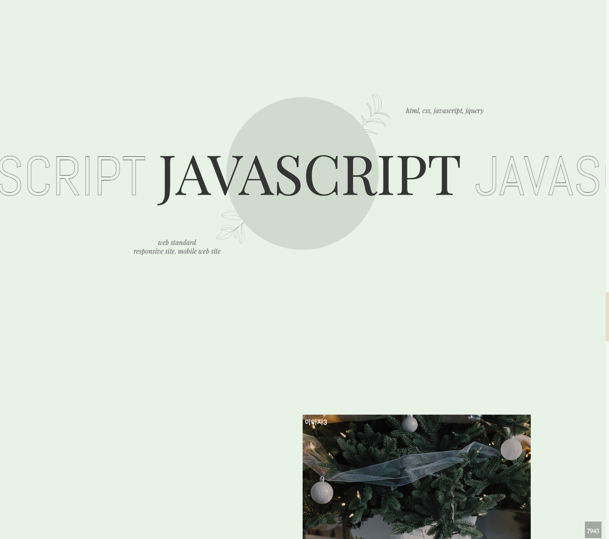
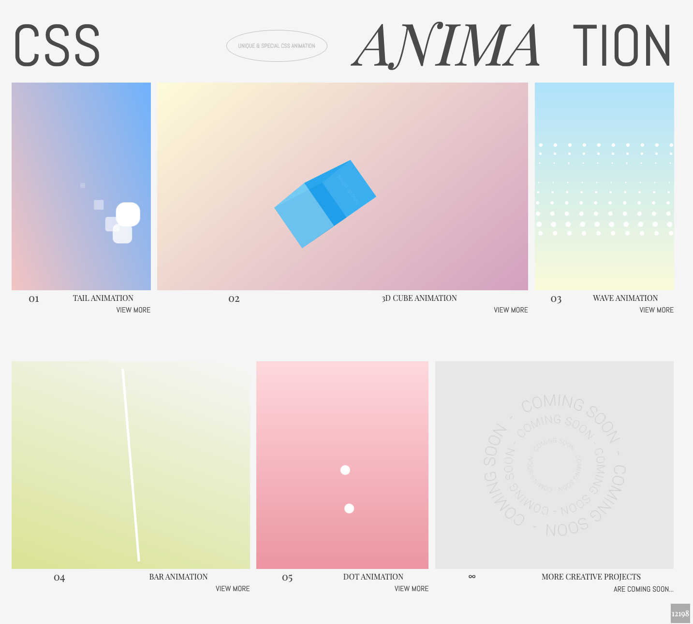
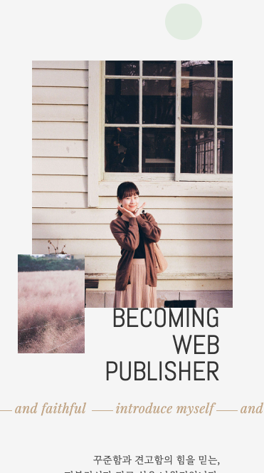
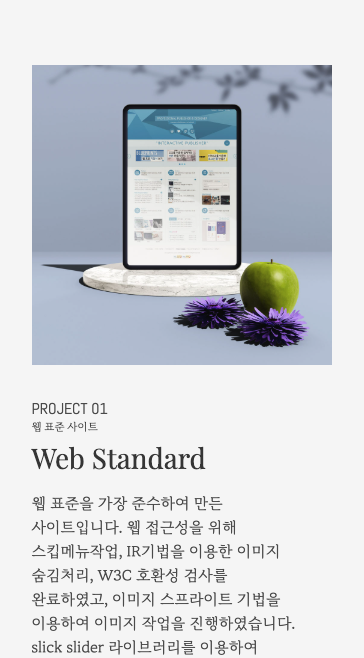

# Rowanna's Next.js Porfolio upgrade project

Welcome to my Next.js Porfolio upgrade project website repository! 🌐  
2020년에 제작한 jQuery 포트폴리오를 Next.js로 업그레이드했습니다.

## 🔗 Live Website

Visit the site here: [nextjs-portfolio-migration.vercel.app](nextjs-portfolio-migration.vercel.app)

## ✨ Features

- 원 페이지 사이트이고 6개의 섹션으로 구성되어 있습니다.

  - intro section
  - info section
  - projects section
  - javascript section
  - css section
  - contact section

- 반응형으로 작업되었습니다.

## 💻 Technologies Used

- **Frontend**: Next.js 15, TypeScript
- **Hosting**: vercel

## 🖼 Screenshots

### intro section

### info section

### projects section

### javascript section

### css section

### contact section

### 반응형 작업

